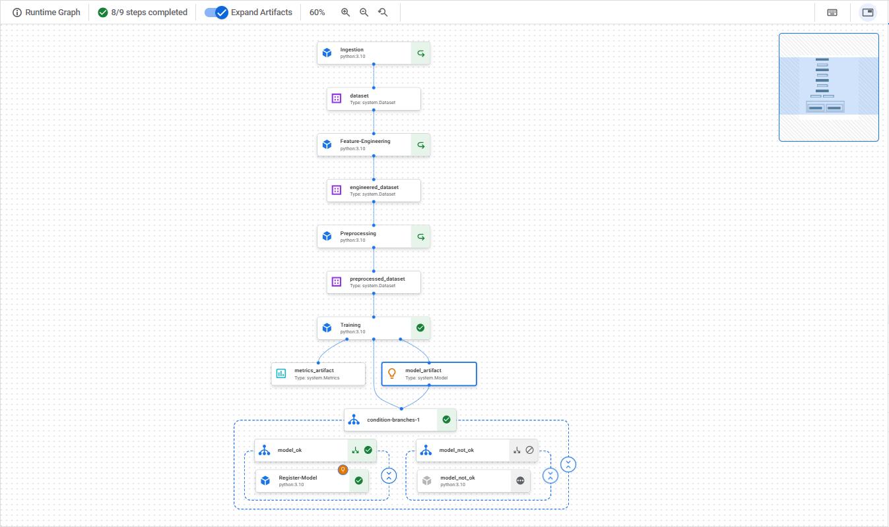

# Churn Prediction Pipeline - Vertex AI

Este proyecto implementa un **pipeline de Machine Learning E2E** en **Vertex AI Pipelines** para predecir la fuga de clientes (*churn prediction*).

El flujo general incluye:
1. **Ingesta de datos** (CSV desde GCS → Parquet).
2. **Feature Engineering** (creación de variables derivadas).
3. **Preprocesamiento** (limpieza, escalado, codificación).
4. **Entrenamiento y validación** (XGBoost con métrica ROC-AUC).
5. **Registro condicional** en **Model Registry**.

---

## 📌 Diagrama del Pipeline




---

## 1️⃣ Clonar el repositorio en una VM de Vertex AI Workbench

```bash
git clone https://github.com/MMejiaCabello/Miguel_Mejia_Assessment_MLE.git
cd 01_pipeline_ml
```

## 2️⃣ Gestión de Entornos Virtuales con Conda y Poetry
    
### Creación de un Entorno con Conda
    
```sh
conda create -n mle_pipeline_env python=3.10
conda activate mle_pipeline_env
```

### Instalación de Poetry en el Entorno de Conda

```sh
conda install -c conda-forge poetry

```

### Configuración de la Estructura del Proyecto con Poetry

```sh
PROJECT_NAME=01_pipeline_ml
poetry new ${PROJECT_NAME}

cd ${PROJECT_NAME}
```

### Adición de Dependencias

```sh
poetry add kfp google-cloud-aiplatform google-cloud-storage
```

## 3️⃣ Variables importantes

En `churn_pipeline.py`, valida las siguientes variables:

```sh
csv_path = "gs://assessment-mle/datasets/clientes.csv"
project_id = "<TU_PROJECT_ID>"
region = "us-central1"
model_display_name = "churn-xgb"
auc_threshold = 0.70
```

- csv_path: Ruta del CSV en GCS.
- project_id: Proyecto de GCP.
- region: Región de Vertex AI.
- model_display_name: Nombre con el que se registrará el modelo.
- auc_threshold: Umbral mínimo de ROC-AUC para registrar el modelo.


## 4️⃣ Compilar el pipeline

Genera el archivo .yaml del pipeline para Vertex AI:

```sh
poetry run python compile_pipeline.py
```
Esto generará churn_pipeline.yaml en la raíz del proyecto.

## 5️⃣ Ejecutar el pipeline en Vertex AI


```sh
poetry run python run_pipeline.py
```
Este script:

- Sube el .yaml a Vertex AI Pipelines.
- Ejecuta el pipeline con parámetros configurados.
- Permite monitorear la ejecución desde la consola de Vertex AI

## 6️⃣ Componentes del Pipeline

| Componente                  | Descripción                                                                                                    |
| --------------------------- | -------------------------------------------------------------------------------------------------------------- |
| **load_data.py**            | Carga el CSV desde GCS, lo convierte a Parquet y lo guarda como artifact `Dataset`.                            |
| **feature_engineering.py**  | Crea variables derivadas como `días desde última compra`, `antigüedad del cliente` y variables de interacción. |
| **preprocess.py**           | Limpieza, codificación y escalado de datos para entrenamiento.                                                 |
| **train_model.py**          | Entrena un modelo XGBoost, calcula métricas y guarda el modelo en formato `.bst` (compatible con Vertex AI).   |
| **register_model.py**       | Registra el modelo en **Model Registry** si el AUC ≥ `auc_threshold`.                                          |


## 7️⃣ Estructura del Proyecto

La estructura del proyecto es la siguiente:

```bash
01_pipeline_ml/
├── compile_pipeline.py        # Compila el pipeline a YAML
├── run_pipeline.py            # Ejecuta el pipeline en Vertex AI
├── pipelines/
│   └── churn_pipeline.py      # Definición del pipeline E2E
├── src/
│   ├── ingestion/
│   │   └── load_data.py
│   ├── features/
│   │   └── feature_engineering.py
│   ├── preprocessing/
│   │   └── preprocess.py
│   ├── training/
│   │   └── train_model.py
│   └── deployment/
│       └── register_model.py
├── data/
│   └── clientes.csv            # Dataset con información de clientes
├── pyproject.toml              # Configuración de Poetry
└── README.md
```

## 8️⃣ Registro de Modelo

El registro en `Model Registry` es condicional:
- ✅ Si ROC-AUC >= auc_threshold → se registra el modelo.
- ❌ Si no → se detiene la ejecución y se deja traza del motivo.

Para forzar registro:
- Cambia auc_threshold = 0.0 temporalmente.

💡 **Nota**: Antes de ejecutar el pipeline en Vertex AI, asegúrate de:
1. Tener habilitadas las APIs necesarias en GCP (`Vertex AI API`, `Artifact Registry API`, `Cloud Storage API`).
2. Contar con permisos adecuados (`roles/aiplatform.admin`, `roles/storage.admin`).
3. Haber configurado el entorno virtual con Poetry y todas las dependencias instaladas.

---